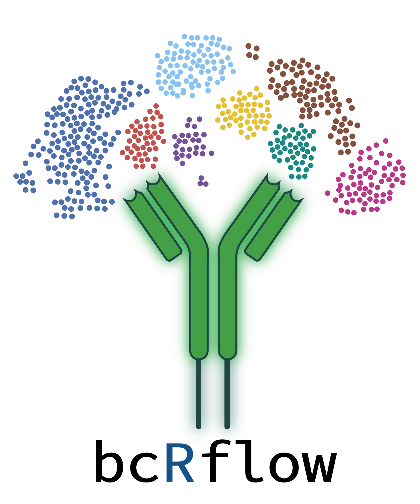

<!-- PROJECT LOGO -->
 

  

<h3 align="center">bcRflow</h3>

  

    A Nextflow Pipeline for Characterizing B-cell Receptor Repertoires from Non-targeted Transcriptomic Data
     
    <a href="https://github.com/Bioinformatics-Core-at-Childrens/bcRflow/tree/main/workflow"><strong>Explore the docs »</strong></a>
     
     
    <a href="https://github.com/Bioinformatics-Core-at-Childrens/bcRflow/issues">Report Bug</a>
    ·
    <a href="https://github.com/Bioinformatics-Core-at-Childrens/bcRflow/issues">Request Feature</a>
  

This is an example case-study for analyzing single-cell RNAseq data using bcRflow! Currently, bcRflow supports data generated by 10X 5' GEX scRNA sequencing, but stay tuned - we plan to leverage MiXCR and immunarch's flexibility to offer support for additional single-cell protocols.

__Sample Data__
*  This single-cell case study compares Long COVID (LC) to non-Long COVID (Non-LC) patients, utilizing 10X 5’ GEX data generated from a multi-omic study (1) on adaptive T-cell mediated immune response in long COVID cases, sourced from GEO under accession number GSE235050.
*  SRA Accession Numbers are provided, and can be downloaded via the sra-toolkit "fastq-dump" utility

__Upstream Processing__
