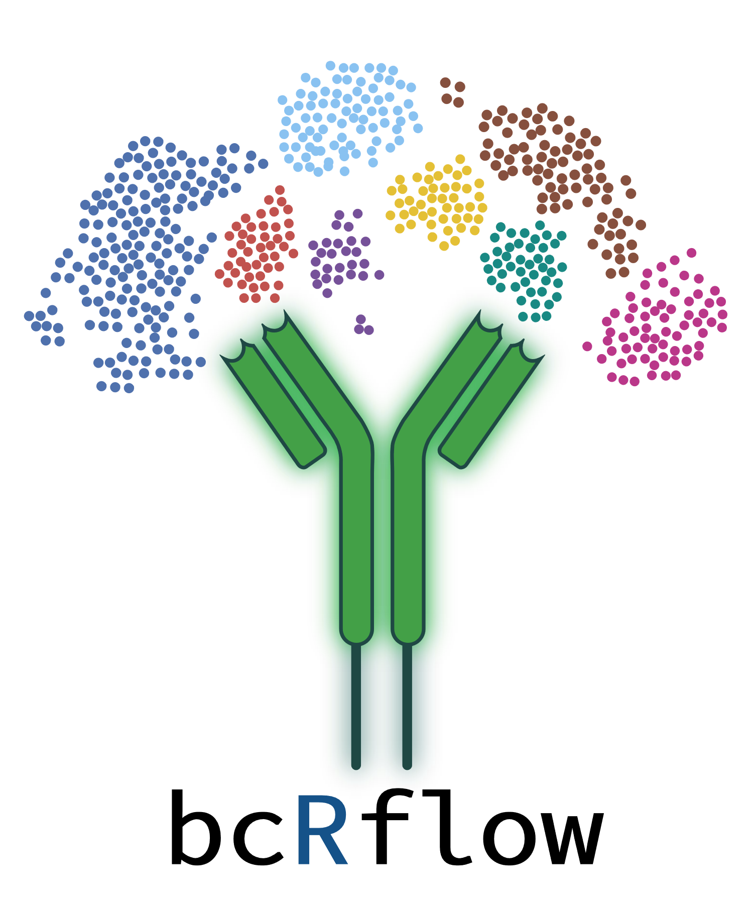
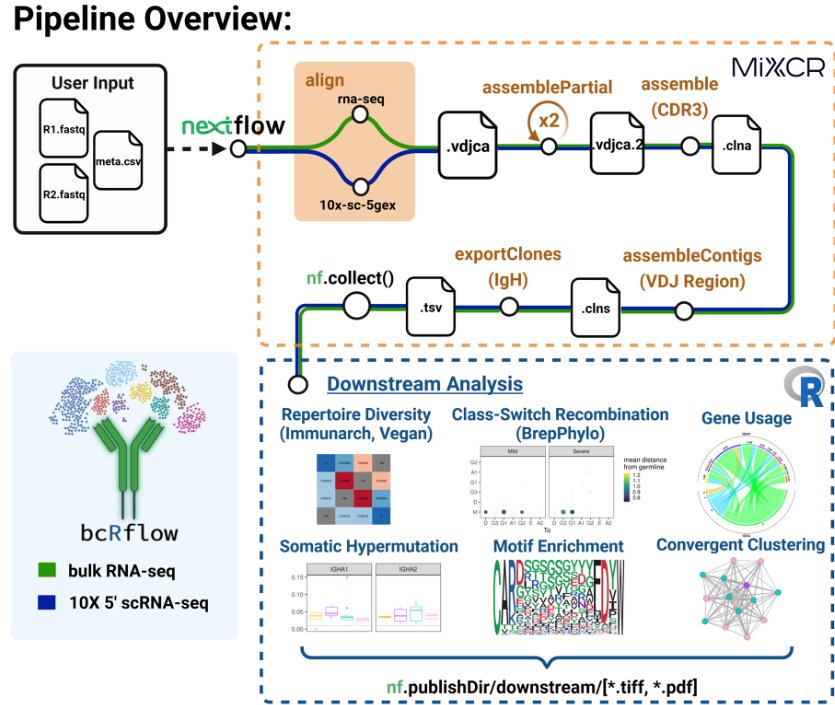

<!-- Improved compatibility of back to top link: See: https://github.com/othneildrew/Best-README-Template/pull/73 -->
<a name="readme-top"></a>
<!--
*** Thanks for checking out the Best-README-Template. If you have a suggestion
*** that would make this better, please fork the repo and create a pull request
*** or simply open an issue with the tag "enhancement".
*** Don't forget to give the project a star!
*** Thanks again! Now go create something AMAZING! :D
-->


<!-- PROJECT SHIELDS -->
<!--
*** I'm using markdown "reference style" links for readability.
*** Reference links are enclosed in brackets [ ] instead of parentheses ( ).
*** See the bottom of this document for the declaration of the reference variables
*** for contributors-url, forks-url, etc. This is an optional, concise syntax you may use.
*** https://www.markdownguide.org/basic-syntax/#reference-style-links
-->
[![Contributors][contributors-shield]][contributors-url]
[![Forks][forks-shield]][forks-url]
[![Stargazers][stars-shield]][stars-url]
[![Issues][issues-shield]][issues-url]
[![MIT License][license-shield]][license-url]
[![LinkedIn][linkedin-shield]][linkedin-url]


<!-- PROJECT LOGO -->
<br />
<div align="center">
  <a href="https://github.com/Bioinformatics-Core-at-Childrens/bcRflow/tree/main/workflow">
    
  </a>

<h3 align="center">bcRflow</h3>

  <p align="center">
    A Nextflow Pipeline for Characterizing B-cell Receptor Repertoires from Non-targeted Transcriptomic Data
    <br />
    <a href="https://github.com/Bioinformatics-Core-at-Childrens/bcRflow"><strong>Explore the docs »</strong></a>
    <br />
    <br />
    <a href="https://github.com/Bioinformatics-Core-at-Childrens/bcRflow/tree/main/scRNA_example">View Demo</a>
    ·
    <a href="https://github.com/Bioinformatics-Core-at-Childrens/bcRflow/issues">Report Bug</a>
    ·
    <a href="https://github.com/Bioinformatics-Core-at-Childrens/bcRflow/issues">Request Feature</a>
  </p>
</div>


<!-- TABLE OF CONTENTS -->
<details>
  <summary>Table of Contents</summary>
  <ol>
    <li>
      <a href="#about-the-project">About The Project</a>
      <ul>
        <li><a href="#built-with">Built With</a></li>
      </ul>
    </li>
    <li>
      <a href="#getting-started">Getting Started</a>
      <ul>
        <li><a href="#prerequisites">Prerequisites</a></li>
        <li><a href="#installation">Installation</a></li>
      </ul>
    </li>
    <li><a href="#usage">Usage</a></li>
    <li><a href="#framework">Pipeline Framework</a></li>
    <li><a href="#contributing">Contributing</a></li>
    <li><a href="#license">License</a></li>
    <li><a href="#contact">Contact</a></li>
    <li><a href="#acknowledgments">Acknowledgments</a></li>
  </ol>
</details>


<!-- ABOUT THE PROJECT -->
## About The Project

* The bcRflow pipeline (©️ 2023) was developed by the team at the Bioinformatics Core @ the UPMC Children's Hospital of Pittsburgh, with additional support from the University of Pittsburgh Center for Research Computing.

* The use of MiXCR and IMGT in this pipeline are for strictly non-commerical, academic purposes.
In order to obtain a non-commercial license to use MiXCR, please see: https://licensing.milaboratories.com/

* For inquiries or technical assistance, please open a new Issue.

* __Any reproductions or publications utilizing this pipeline should attribute all proper credit for development to the Development team (see above).__

<p align="right">(<a href="#readme-top">back to top</a>)</p>


### Built With

* MiXCR (Version 4.6)
* Nextflow (Version 23.04.2, DSL2 enabled)
* R (Version 4.3.0)
* Docker / Docker Hub

<p align="right">(<a href="#readme-top">back to top</a>)</p>

<!-- GETTING STARTED -->
## Getting Started

bcRflow utilizes nf-core configurations for wide availability to run on multiple institutional computing resources and cloud-based utilities like AWS. For additional information on available configurations and how to use them, see: https://nf-co.re/configs. Users must install Nextflow, Docker or Singularity, and squashfs-tools (for building the Singularity container in a linux environment). All other software dependencies are handled behind the scenes with our precompiled Docker container. Users must generate a unique academic MiXCR license in order to run MiXCR, see https://mixcr.com/mixcr/getting-started/milm/ for details. 

### Prerequisites
* Nextflow >= 23.04.2
* Docker or Singularity
* squashfs-tools (available on most systems)
* For HPC jobs, nodes require internet access for MiXCR license validation
  * Offline use:
    MiXCR requires internet access to periodically validate license key. For running MiXCR in the environment with restricted internet access, please add the following MiXCR IPs to the whitelist in the firewall settings:
    ```js
    IPv4:
    75.2.96.100
    99.83.215.63
    
    IPv6:
    2600:9000:a403:55e8:f9c1:f443:773b:4192
    2600:9000:a51b:2483:639d:d5a9:270f:6439
    ```


### Installation

1. Get a free MiXCR Academic License at [https://licensing.milaboratories.com/](https://licensing.milaboratories.com/), and activate the license.
2. Clone the repo
   ```sh
   git clone https://github.com/Bioinformatics-Core-at-Childrens/bcRflow/tree/main/workflow.git
   ```
3. Install Nextflow: [https://www.nextflow.io/docs/latest/getstarted.html](https://www.nextflow.io/docs/latest/getstarted.html)
4. Enter your MiXCR License in `nextflow.config`
   ```js
   mixcr_license = 'ENTER YOUR LICENSE';
   ```

<p align="right">(<a href="#readme-top">back to top</a>)</p>

<!-- USAGE EXAMPLES -->
## Usage
* Set your sample metadata file according to the following structure (comma-separated):
  ```sh
  | SampleID  | R1                            | R2                            | Group     |
  |---------- |------------------------------ |------------------------------ |--------   |
  | Sample1   | /path/to/fastq/Sample1_R1.fq  | /path/to/fastq/Sample1_R2.fq  | Group1    |
  | (...)     | (...)                         | (...)                         | (...)     |
  | SampleN   | /path/to/fastq/SampleN_R1.fq  | /path/to/fastq/SampleN_R2.fq  | GroupN    |
  ```
  __(see /db/sampleslist.csv for a template)__

* Edit the nextflow.config file:
  ```js
   readsfile     = "/path/to/samplesList.csv" // path to sample metadata file
   project_name  = "project_name"
   species       = 'hsa' //species should be one of 'hsa' or 'mmu'
   chain         = "IGH" //chain of interest (default of IGH)
   indir         = "/path/to/fastq" // path to FASTQ files
   outdir        = '/path/to/outdir/bcRflow-out' // path to desired output directory
   is_sc         = true //true if 10X 5' GEX samples, false if bulk
   igmt          = './db/imgt.202214-2.sv8.json' // don't change this
   mixcr_license = 'ENTER YOUR LICENSE' //paste your MiXCR license here (the string, not the file path)
   custom_config_base = '../configs/conf' // path to folder containing institutional configs
  ```

* If using the Slurm workflow, adjust the script for your submission node accordingly, and submit:
  ```sh
    cd ./bcRflow/workflow # enter the bcRflow directory
    nextflow run ./main.nf -profile slurm -resume -work-dir ./work #set the relative paths according to your directory
  ```

<p align="right">(<a href="#readme-top">back to top</a>)</p>

<!-- FRAMEWORK -->
## Pipeline Framework




- [ ] Nextflow Configuration and Submission
- [ ] MiXCR Alignment and Assembly
    - [ ] Alignment (bulk or 10X 5' GEX)
    - [ ] Partial Assembly (2 rounds)
    - [ ] Clonotype Assembly (by CDR3)
    - [ ] Contig Assembly (by VDJ)
    - [ ] Export IGH clones
- [ ] Downstream Analysis
    - [ ] Repertoire Diversity (Immunarch and Vegan)
    - [ ] Variable Gene Usage (IGH-V and IGH-V/J pairs)
    - [ ] Somatic Hypermutation (MiXCR)
    - [ ] Class-Switch Recombination (BrepPhylo and DNApars)
    - [ ] Convergent Clustering and Clonal Networks (identify shared clonal sequencees)

See the [open issues](https://github.com/Bioinformatics-Core-at-Childrens/bcRflow/issues) for a full list of proposed features (and known issues).

<p align="right">(<a href="#readme-top">back to top</a>)</p>

<!-- CONTRIBUTING -->
## Contributing

Contributions are what make the open source community such an amazing place to learn, inspire, and create. Any contributions you make are **greatly appreciated**.

If you have a suggestion that would make this better, please fork the repo and create a pull request. You can also simply open an issue with the tag "enhancement".
Don't forget to give the project a star! Thanks again!

1. Fork the Project
2. Create your Feature Branch (`git checkout -b feature/AmazingFeature`)
3. Commit your Changes (`git commit -m 'Add some AmazingFeature'`)
4. Push to the Branch (`git push origin feature/AmazingFeature`)
5. Open a Pull Request

<p align="right">(<a href="#readme-top">back to top</a>)</p>


<!-- LICENSE -->
## License

Distributed under the MIT License. See `LICENSE` for more information.

<p align="right">(<a href="#readme-top">back to top</a>)</p>

<!-- CONTACT -->
## Contact
* Development Lead: Brent T. Schlegel - BTS76@pitt.edu
* Corresponding Author: Dhivyaa Rajasundaram - DHR11@pitt.edu
* Project Link: [https://github.com/Bioinformatics-Core-at-Childrens/bcRflow/tree/main/workflow](https://github.com/Bioinformatics-Core-at-Childrens/bcRflow/tree/main/workflow)

<p align="right">(<a href="#readme-top">back to top</a>)</p>

<!-- ACKNOWLEDGMENTS -->
## Acknowledgments

* []() Dhivyaa Rajasundaram, PhD
* []() Michael Morikone, PhD
* []() Fangping Mu, PhD
* []() Wan-Yee Tang, PhD
* []() Gary Kohanbash, PhD


<p align="right">(<a href="#readme-top">back to top</a>)</p>

<!-- MARKDOWN LINKS & IMAGES -->
<!-- https://www.markdownguide.org/basic-syntax/#reference-style-links -->
[Nextflow]: https://www.nextflow.io/
[MiXCR]: https://mixcr.com/
[contributors-shield]: https://img.shields.io/github/contributors/Bioinformatics-Core-at-Childrens/bcRflow.svg?style=for-the-badge
[contributors-url]: https://github.com/Bioinformatics-Core-at-Childrens/bcRflow/graphs/contributors
[forks-shield]: https://img.shields.io/github/forks/Bioinformatics-Core-at-Childrens/bcRflow.svg?style=for-the-badge
[forks-url]: https://github.com/Bioinformatics-Core-at-Childrens/bcRflow/tree/main/workflow/network/members
[stars-shield]: https://img.shields.io/github/stars/Bioinformatics-Core-at-Childrens/bcRflow.svg?style=for-the-badge
[stars-url]: https://github.com/Bioinformatics-Core-at-Childrens/bcRflow/tree/main/workflow/stargazers
[issues-shield]: https://img.shields.io/github/issues/Bioinformatics-Core-at-Childrens/bcRflow.svg?style=for-the-badge
[issues-url]: https://github.com/Bioinformatics-Core-at-Childrens/bcRflow/issues
[license-shield]: https://img.shields.io/github/license/Bioinformatics-Core-at-Childrens/bcRflow.svg?style=for-the-badge
[license-url]: https://github.com/Bioinformatics-Core-at-Childrens/bcRflow/tree/main/workflow/LICENSE
[linkedin-shield]: https://img.shields.io/badge/-LinkedIn-black.svg?style=for-the-badge&logo=linkedin&colorB=555
[linkedin-url]: https://linkedin.com/in/brent-schlegel-539638173
[product-screenshot]: images/screenshot.png
[Next.js]: https://img.shields.io/badge/next.js-000000?style=for-the-badge&logo=nextdotjs&logoColor=white
[Next-url]: https://nextjs.org/
[React.js]: https://img.shields.io/badge/React-20232A?style=for-the-badge&logo=react&logoColor=61DAFB
[React-url]: https://reactjs.org/
[Vue.js]: https://img.shields.io/badge/Vue.js-35495E?style=for-the-badge&logo=vuedotjs&logoColor=4FC08D
[Vue-url]: https://vuejs.org/
[Angular.io]: https://img.shields.io/badge/Angular-DD0031?style=for-the-badge&logo=angular&logoColor=white
[Angular-url]: https://angular.io/
[Svelte.dev]: https://img.shields.io/badge/Svelte-4A4A55?style=for-the-badge&logo=svelte&logoColor=FF3E00
[Svelte-url]: https://svelte.dev/
[Laravel.com]: https://img.shields.io/badge/Laravel-FF2D20?style=for-the-badge&logo=laravel&logoColor=white
[Laravel-url]: https://laravel.com
[Bootstrap.com]: https://img.shields.io/badge/Bootstrap-563D7C?style=for-the-badge&logo=bootstrap&logoColor=white
[Bootstrap-url]: https://getbootstrap.com
[JQuery.com]: https://img.shields.io/badge/jQuery-0769AD?style=for-the-badge&logo=jquery&logoColor=white
[JQuery-url]: https://jquery.com 
